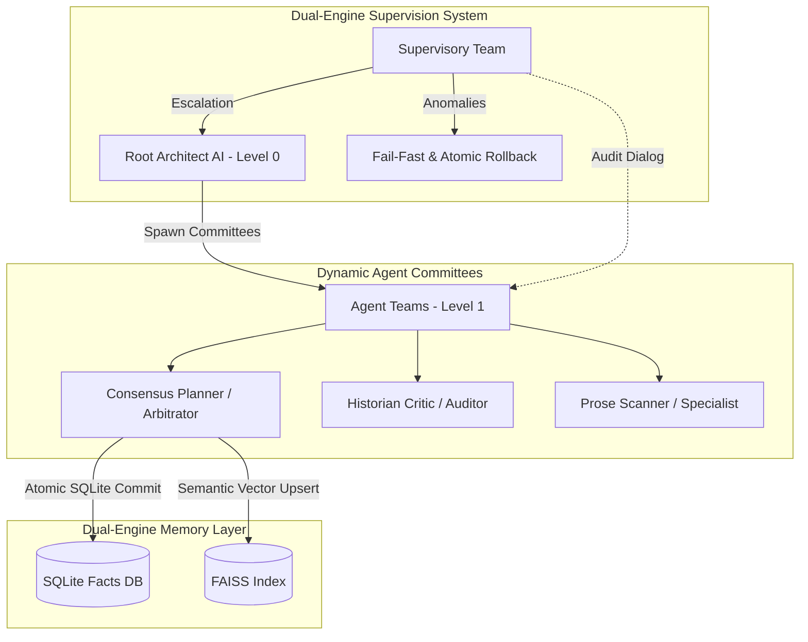
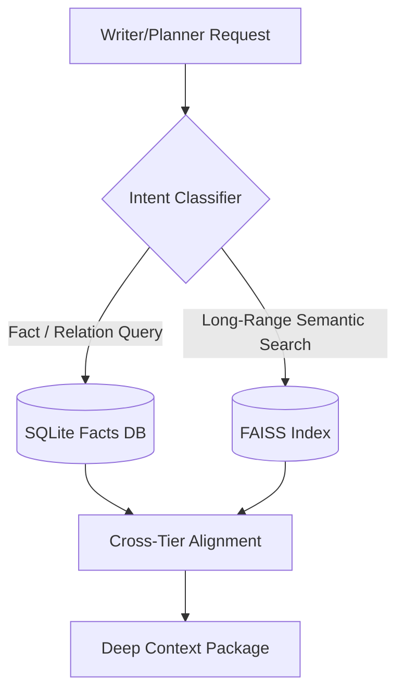
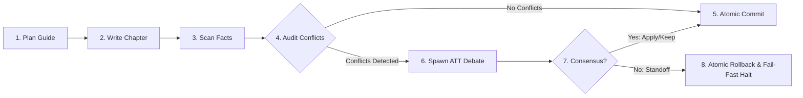

# AI Novel Writer

A multi-agent system designed to write long-form coherent novels by maintaining a structured, multi-tier memory of the world, characters, and plot.

The current ATT is already awesome, and who knows what more this project can achieve in the future! 🥰

Many thanks to Gemini and GPT for their help!

> [!NOTE]
> The project already features a lot of really fun and innovative designs, with an even more groundbreaking architecture in the works. \
> (It’s still a little rough around the edges though 👀)

> [!TIP]
> If you notice any issues or have any suggestions and have the time, \
> please leave them in the Issues section. Thank you.

[👉 Project Architecture](docs/Architecture.md) | [👉 Flowchart](docs/Flowchart/README.md) | [👉 User Guide](docs/User_Guide.md) | [👉 Documents](docs/)

## 🚀 Advanced Project Architecture: The ATT (AI/Agent Team Team) Topology

This project utilizes a highly sophisticated and pioneering **ATT (AI Team Team / Agent Team Team)** tree-like lineage topology to ensure narrative structure, voice parity, and database sanity.

Instead of simple static pipelines, tasks are delegated to dynamically spawned committees (Level 1 Agent Teams) under the supervision of a Level 0 Root Architect.

### System Topology & Gating Flow



## 🌟 Key Architectural Features

* **Tree-Like AI Team Team (ATT) Spawning**: A structured lineage tree scaling from `Level 0 Root Architect` to `Level 1 Dynamic Committees` (max delegation depth = 2). Teams resolve sub-tasks autonomously, negotiating inter-team talk via parent permissions and a communication broker.
* **Dynamic Multi-Agent Committees**:
  * **Chapter Planning Committee**: Refines narrative contracts and guides, matching world bible rules.
  * **Chapter Editorial Committee**: Critiques style/voice and compiles final polished chapter prose drafts.
  * **Conflict Resolution Committee**: Resolves hard timeline contradictions through bounded debates, making atomic commits or triggering Fail-Fast blocks.
* **Dual-Engine Supervisory Audits**: A dedicated 3-Auditor `SupervisoryTeam` monitors dialogue transcripts to prevent circular logical deadlocks, override high cost runs, and audit system integrity.
* **Atomic Transactions & Rollback**: Complete database state protection. If a debate ends in a `STANDOFF`, system executes automated atomic rollback of both FAISS vector indexes and SQLite relational tables, halting execution (Fail-Fast).
* **Double-Engine Hybrid Memory**: Blends strict relation logic (SQLite facts, rules, and character properties) with semantic long-range vector search (FAISS) utilizing a clean, decoupled Embedding client architecture.
* **Intent-Gated Retrieval Chain**: Planning and writing processes enforce a strict `Intent Classifier -> SQLite Pre-filtering -> FAISS Retrieval -> Cross-Tier Memory Alignment` pipeline.
* **Exhaustive Interruption Recovery**: Fully autonomous state integrity check, scanning all runtime artifact footprints before resuming.
* **Deep Language Guard**: High-confidence confidence-based language detection and active rewrite loops natively configured inside the `i18n/` directory.

## 🧠 Double-Engine Hybrid Memory System

AI-Novel uses an advanced, highly precise hybrid memory engine to eliminate hallucinations and retain temporal integrity across hundreds of thousands of words.

It bifurcates memory into:

1. **Relational Database (SQLite)**: Preserves "hard" rules, characters state attributes, and active world bible criteria.
2. **Vector Space Index (FAISS)**: Captures "soft" long-range semantic descriptions and chapter outlines.

### Intent-Gated Retrieval Chain



## 🔄 Continuous Autonomous Novel Generation Loop

The writing workspace executes a strict, automated cycle to plan, generate, evaluate, and commit each chapter. It protects core story bounds by performing atomic rollback transactions on logical collisions.



## 🔬 Micro-Innovations & Fine-Grained Optimizations

Beyond the core ATT architecture and database engines, AI-Novel implements several highly tailored microscopic optimizations:

* **Dual-Confidence Language Guard**: Prevents multi-language mixing drift. Employs a strict confidence score audit (`zh` vs `en`) inside custom LLM responses, automatically triggering localized fallback rewrite loops on target failures.
* **Normalized Discussion Templates**: Standardizes all planning, editorial, and conflict resolution debates into a single unified markdown schema, compiling transcripts under the central `process/discussions/` directory with automated indexing.
* **Decoupled Vector Embeddings**: Allows separate execution endpoints for LLM text generation and vector calculations, facilitating heterogeneous model configuration and significantly saving computing budgets.
* **Self-Healing Interruption Resume**: Thoroughly scans all active sqlite schemas, cloning FAISS indices, and validating the checksum integrity of temporary chapter drafts before resuming auto-writing tasks.
* **Multi-Tier Severity Triage**: Contradictions scanned inside chapter drafts are classified dynamically into `BLOCKING` (unjustified character resurrection, bible rules override) and `NON_BLOCKING` (minor status updates), preventing unnecessary agent debate triggers.

## Installation

1. **Prerequisites:**
   * Python 3.10+
   * (Optional) A supported local LLM model (GGUF format) for Llama.cpp or an OpenAI-compatible server.
   * (Optional) A supported local Embedding model for Llama.cpp or an OpenAI-compatible server.

2. **Install Dependencies:**

   ```bash
   pip install -r requirements.txt
   ```

3. **Configuration:**
   * Open `config.yaml`.
   * Set `LANGUAGE = "Chinese"` or `"English"`.
   * Configure role model routing and workflow controls.

### 1. Initialize Workspace

```bash
python src/main.py --init
```

Fill `novel/Novel_Overview.md` and start:

```bash
python src/main.py --start
```

### 2. Manual Workflow

* **Plan:** `python src/main.py --plan 1`
* **Write:** `python src/main.py --write 1`
* **Scan:** `python src/main.py --scan 1`
* **Conflicts:** `python src/main.py --conflicts-triage`

### 3. Continuous Writing (Auto Mode)

```bash
# Generate 5 chapters starting from Chapter 1
python src/main.py --auto 1 5
```
