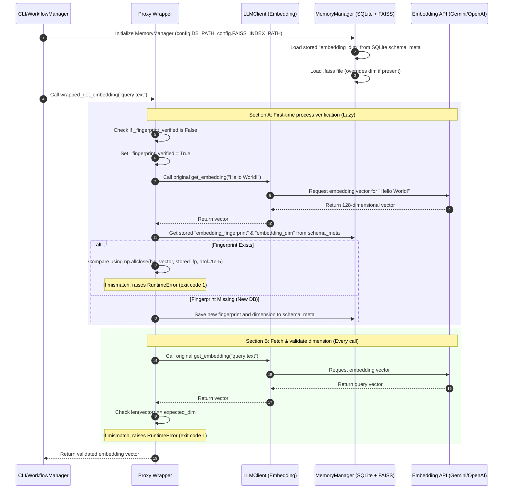

# Dynamic Embedding Dimension & Fingerprint Validation System

This design document outlines the architecture, mechanisms, and implementation of the **Dynamic Embedding Dimension and Fingerprint Validation System** in the AI-Novel generator.

## 1. Context & Motivation

In previous iterations, the embedding model dimension was explicitly defined in configuration files (e.g., `dim: 768`). This presented several core limitations and risks:

1. **Redundancy & Mismatch Risk**: The user had to manually specify the dimension, introducing potential friction if they switched models but forgot to update the parameter.
2. **FAISS Index Corruption**: If a user switched the active embedding model on an existing project database (e.g., swapping a 768-dimensional model for a 1536-dimensional model, or a different model with the same dimensions but different semantic space) without rebuilding, the FAISS index would become corrupted or yield garbage semantic search results.
3. **Resource Waste**: Checking the embedding model fingerprint on every single API call would require a roundtrip network request to embed a validation payload (e.g., `"Hello World!"`), which wastes tokens, consumes credits, and introduces significant latency.

To address these concerns, this system introduces a **decoupled configuration, dynamic autodetection, lazy single-run fingerprinting, and zero-cost local dimension checking** approach.

## 2. System Architecture & Component Interaction

The validation system uses a **Proxy Pattern** around the `LLMClient`'s embedding interface, coordinating with `MemoryManager` (SQLite) and `FAISS` to enforce validation rules.

## 3. Core Mechanisms

### 3.1. SQLite as the Single Source of Truth

The configuration yaml files no longer contain any dimension parameters. Instead, `MemoryManager` and the proxy wrapper rely entirely on the SQLite `schema_meta` table.

* **Initialization Flow**:
  1. `MemoryManager` opens the SQLite database.
  2. It queries `schema_meta` for `embedding_dim`. If found, `self.embedding_dim` is updated to that integer.
  3. It initializes the FAISS index. If the `.faiss` file already exists on disk, `self.embedding_dim` is automatically synchronized with the actual dimension of the FAISS index (`self.index.d`).
* **Dynamic Creation**:
  If the FAISS index does not exist (new story project), the first time a semantic fact is added via `add_semantic_fact`, the system captures the dimension from the returned embedding and writes it to SQLite `schema_meta` under key `"embedding_dim"`.

### 3.2. Lazy Process-Run Fingerprinting

To avoid performing network-expensive model validation on every embedding call, the proxy wrapper uses a lazy verification mechanism:

1. **State Flags**: The wrapper defines `self.embedding_client._fingerprint_verified = False` on startup.
2. **First-Call Interception**: The first time `get_embedding` is invoked in a process session, the validation wrapper intercepts it, locks `_fingerprint_verified = True`, and embeds the string `"Hello World!"`.
3. **Float-tolerant Comparator**: Embedding vectors returned by remote APIs (such as OpenAI or Gemini) can have microscopic floating-point variations due to remote server optimizations or precision formats. Therefore, the system compares the newly generated fingerprint with the database-stored array using:
   $$\text{numpy.allclose}(\text{hw\_vector}, \text{existing\_fp}, \text{atol}=10^{-5})$$
   Strict equality comparisons are avoided to eliminate false alerts.
4. **Subsequent Bypass**: For all subsequent calls to `get_embedding` in the same execution run, the wrapper sees `_fingerprint_verified == True` and completely skips the `"Hello World!"` network request, saving API token usage and removing overhead.

### 3.3. Continuous Local Dimension Verification

While fingerprinting runs once, **dimension validation runs on every call** to `get_embedding`:

* When a vector is returned, the wrapper checks:
  $$\text{len(vector)} == \text{expected\_dim}$$
* The `expected_dim` is fetched dynamically (checking FAISS index shape first, then SQLite `schema_meta`, then internal memory fields).
* Checking the length of a local list is an $O(1)$ operation in Python with virtually zero memory or CPU cost. It guarantees that any sudden dimension mismatch (e.g., mid-run reconfiguration or server updates) is immediately caught before committing garbage shapes to the FAISS index.

### 3.4. Safe Migration Flow (Rebuilding Vectors)

If a user legitimately decides to switch embedding models, a standard run will block them with a model mismatch error. To allow model transitions, the `--rebuild-vectors` command implements a safe migration flow:

1. **Bypass Flag**: When `WorkflowManager.rebuild_vector_index()` starts, it sets `_bypass_all_checks = True` on the client.
2. **Rebuild**: `MemoryManager.rebuild_vector_index_from_metadata` processes all existing text segments, fetches embeddings from the new model (bypassing dimension checks), and reconstructs a brand-new FAISS index matching the new dimension.
3. **Save Metadata**:
   * The database stored `embedding_dim` is updated to the new model's dimension.
   * A new `"Hello World!"` fingerprint is generated using the new model and saved to SQLite `schema_meta` as the new benchmark.
4. **Re-engage**: `_bypass_all_checks` is reset to `False`, and `_fingerprint_verified` is marked as `True`, fully locking in the new model.

## 4. SQLite Schema Metadata Specs

The system stores configuration state inside the key-value schema table `schema_meta`:

| Key | Description | Type / Format |
| :--- | :--- | :--- |
| `"embedding_dim"` | Stored dimension of the active model. | `TEXT` (Stringified integer, e.g. `"128"`, `"768"`, `"1536"`) |
| `"embedding_fingerprint"` | Float vector representation of the string `"Hello World!"`. | `TEXT` (JSON serialized array of floats, e.g., `"[0.123, -0.456, ...]"` ) |

## 5. Benefits Summary

* **Zero-Configuration Maintenance**: Users no longer need to track or set the `dim` parameter. The system autodetects it.
* **Fail-Safe Operation**: Completely guards the local vector database against silent structural corruption due to swapping models.
* **Ultra-Low Latency & Cost-Effective**: Restricts expensive remote validation requests to a maximum of one request per run, while enforcing strict vector checks on every call.
