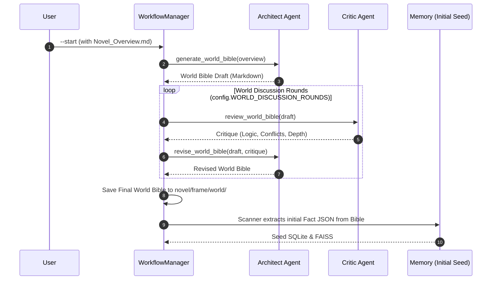
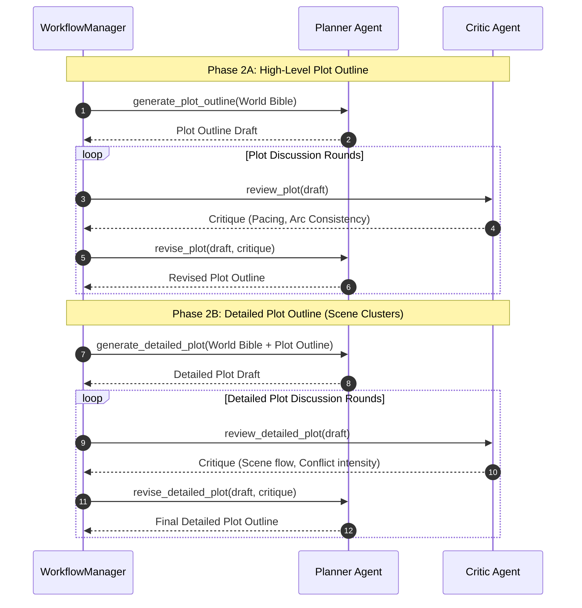
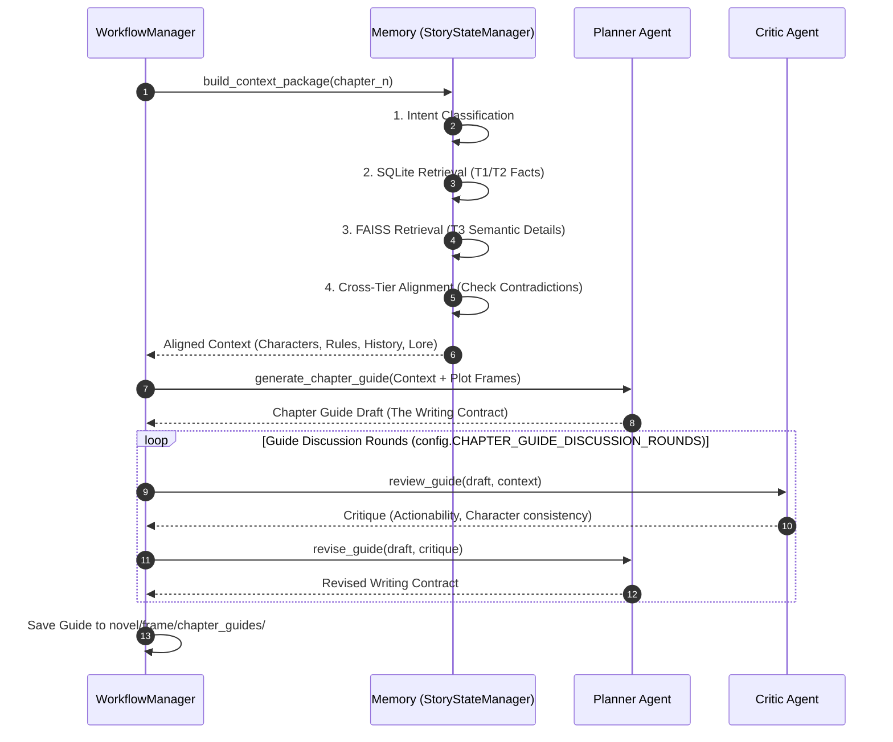
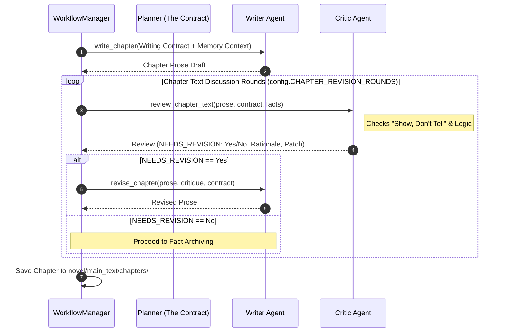
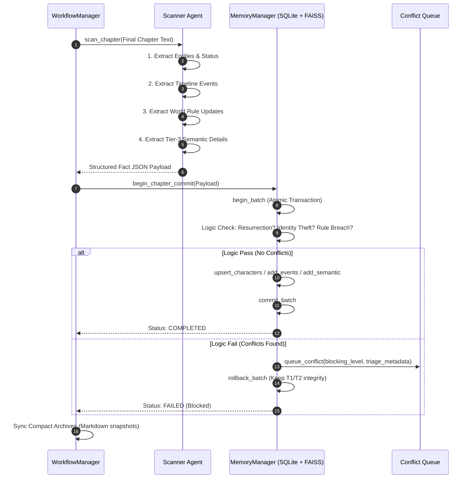

# Flowchart

This document uses flowchart to describe the operational logic of each module in the entire project.

> [!NOTE]
> This document was largely written by AI and the content described at present is incomplete,
> so it is for reference only.

## 1. Project Initialization Phase (Architect ↔ Critic)

This phase establishes the "DNA" of the novel. The Architect proposes the world, and the Critic ensures it's robust enough for a long-form story.

## 2. Strategic Plot Planning (Planner ↔ Critic)

Before any chapters are written, the Planner and Critic collaborate to define the "High-Level" and "Detailed" plot frames.

## 3. Chapter Planning Loop (Planner ↔ Critic ↔ Memory)

This sequence occurs for every chapter. The Planner acts as a "Contractor," defining what the Writer must deliver.

## 4. Chapter Writing & Peer Review (Writer ↔ Critic ↔ Planner)

The Writer executes the "Contract" while the Critic ensures the output doesn't stray from the facts or the guide.

## 5. Fact Extraction & Memory Persistence (Scanner ↔ Memory)

The "Archivist" phase where narrative results are converted back into structured data for future chapters.

