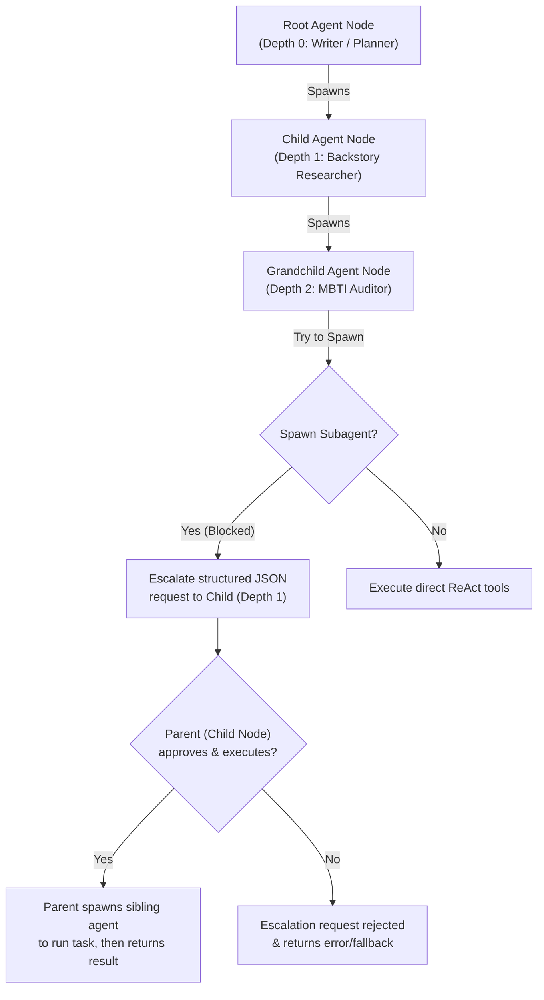
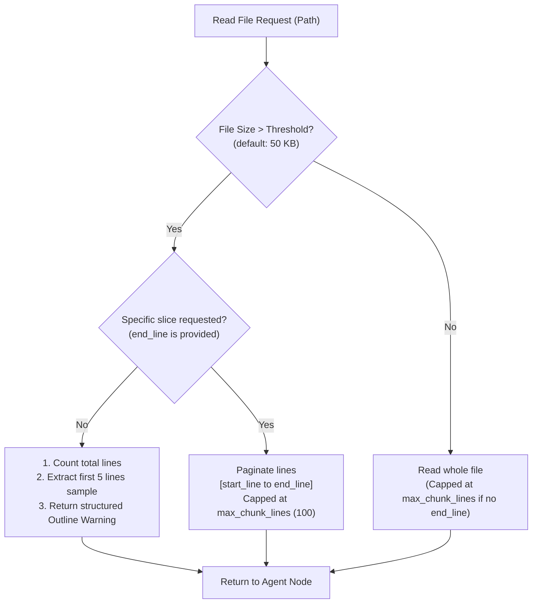
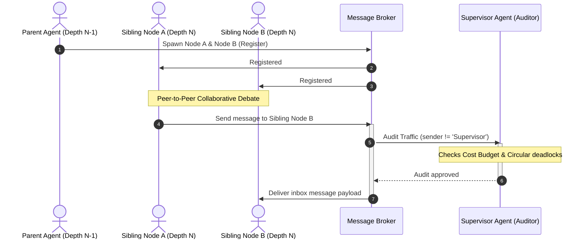
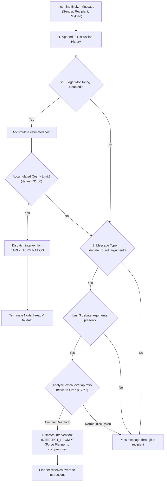

# AI Autonomy & Subagent Delegation Flow

This document details the architectural layout, flowcharts, and operational logic of the **High-Level AI Autonomy, Hierarchical Dynamic Subagent Delegation, and Supervisor Auditor Agent** suite.

---

## 1. Multi-Agent Delegation Tree (Spawning Limits)

To prevent run-away recursive agent loops, spawning is strictly gated at a maximum depth of 2 (Root = Depth 0, Child = Depth 1, Grandchild = Depth 2). Any further spawning requests by a Grandchild are intercepted and escalated back up to the Child node as structured JSON messages.

---

## 2. Gated File Reader (Context Protection Window)

To protect the LLM context window from massive logs or data dumps, direct reading of large files is dynamically blocked based on size. Large files must be queried selectively using paginated slice-reads.

---

## 3. Communication & Message Routing Broker

Agents communicate via a centralized `MessageBroker`. Sibling peer nodes can collaborate on shared topics, while all messages are routed asynchronously through the broker to allow continuous audits.

---

## 4. Supervisor Agent Intervention Loop

The **Supervisor Agent** operates as an asynchronous, non-participating observer. It subscribes to the `MessageBroker` and intercepts traffic, keeping track of total session costs and analyzing discussions for circular arguments.

---

## 5. Summary of Supervisor Intervention Commands

| Command | Triggers | Action Taken |
| :--- | :--- | :--- |
| **`INTERJECT_PROMPT`** | Circular lexical repetition detected across a 3-turn debate sliding window. | Injects strict override prompt to force the Planner to synthesize a compromise immediately on the next turn. |
| **`EARLY_TERMINATION`** | Total accumulated session cost exceeds budget cap (e.g. `$1.00`). | Shuts down the team execution, aborting the active transaction and triggering a fail-fast standby. |
| **`PRUNE_NODE`** | Subagent has finished its assigned research task. | Safely shuts down the child node, frees allocated memory, and cleans up active DB connections. |
