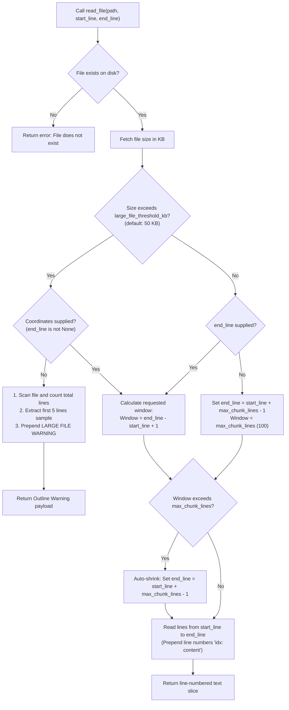
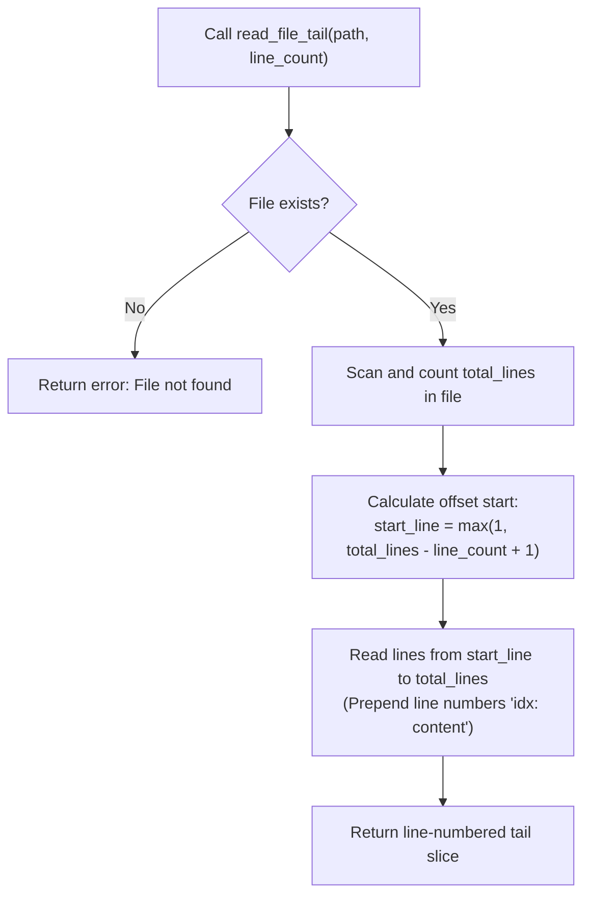

# Gated Paginator Reading Flowchart

This document visualizes the control flow and slice boundaries enforced by the size-aware `GatedFileReader`.

## 1. Gated Read File Decision Flowchart

This flowchart outlines the logic executed when an agent node calls the `read_file(path, start_line, end_line)` tool:

## 2. Streaming Tail Read Decision Flowchart

This flowchart visualizes the log tailing helper `read_file_tail(path, line_count)`:

