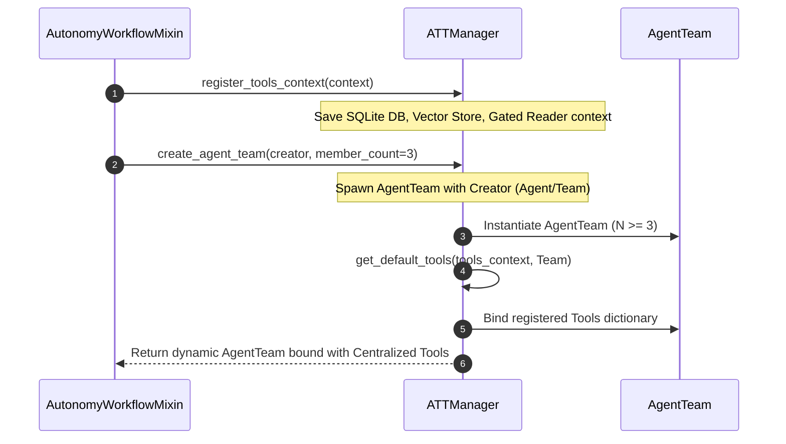
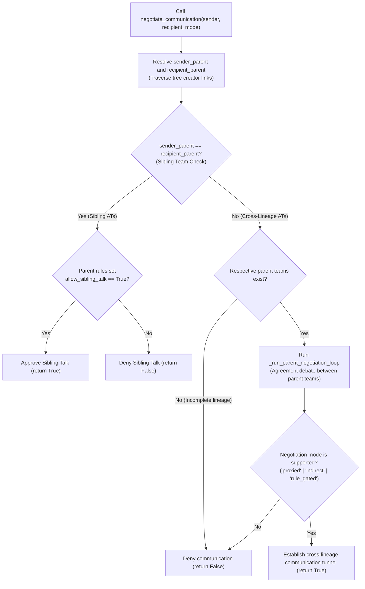

# Negotiation Broker & Sibling Routing Flowchart

This document details the dynamic P2P sibling and cross-lineage communication permissions negotiated by the `NegotiationBroker` under the ATT framework.

## 1. Sequence of Tools Context Registration & Team Spawning

This sequence diagram outlines the registration of system-wide dependencies and automatic tools binding during dynamic team spawning:

## 2. Sibling & Cross-Lineage Negotiation Flowchart

This flowchart outlines the gating logic executed inside `NegotiationBroker.negotiate_communication` when a dynamic team attempts to establish a communication tunnel with a peer:

