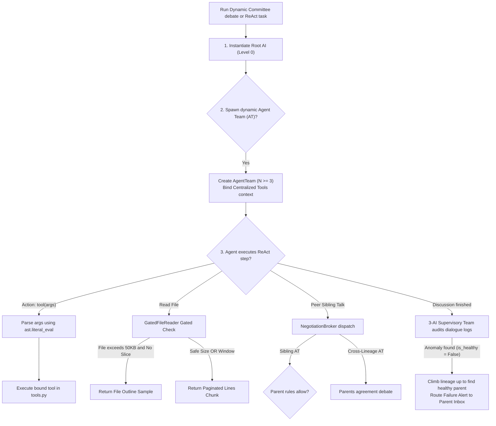

# ATT Autonomy Suite Flowcharts

This directory contains detailed technical flowcharts and Mermaid sequencing diagrams detailing the operational control flows of the **ATT (AI Team Team) Autonomy & Dynamic Delegation Suite**.

## Flowchart Index

Please refer to the following documents for granular flow diagrams:

1. **[Spawning & Escalation Channels](Spawning_Escalation.md)**: Details the recursive `AgentTeam` lineages (Level 0 Root AI spawning Level 1 ATs, who recursively spawn Level 2 ATs) and the dynamic closed-loop parent escalation alerts.
2. **[Gated Paginator Reading](Gated_Reading.md)**: Visualizes the context protection pre-filters, outline generation samples, and paginated line-numbered chunk slicing logic.
3. **[Negotiation Broker & Sibling Routing](Negotiation_Broker_Sibling_Routing.md)**: Sequences the dynamic P2P sibling and cross-lineage communication permissions negotiated by the `NegotiationBroker`.
4. **[Supervisory Team Audits & Escalations](Supervisory_Team_Audit.md)**: Diagrams the 3-AI Supervisory Team's dialogue auditing and the recursive parent-ancestor climb escalation process.

## Unified High-Level Flow Overview

The ATT Suite coordinates the interaction of these four systems in a decoupled, event-driven pattern:

