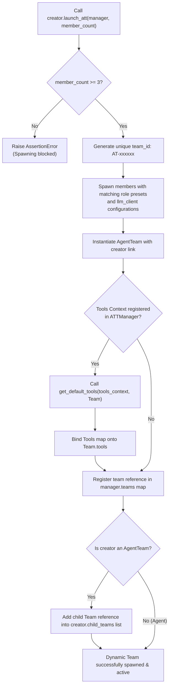
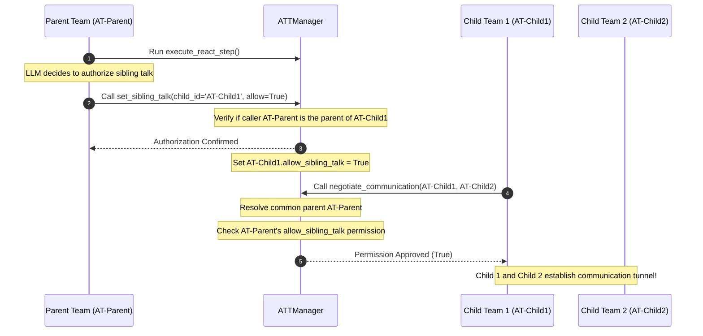

# Spawning & Escalation Channels Flowchart

This document details the control flow of the dynamic, recursive `AgentTeam` spawning lineage and sibling communication gating.

## 1. Dynamic Spawning & Tool Binding Flowchart

This flowchart outlines the logic executed when an individual `Agent` or `AgentTeam` launches a dynamic sub-team:

## 2. Dynamic Sibling Talk Authorization Sequence

This sequence diagram illustrates how a Parent Team calls `set_sibling_talk` to dynamically authorize Sibling Teams to communicate:

