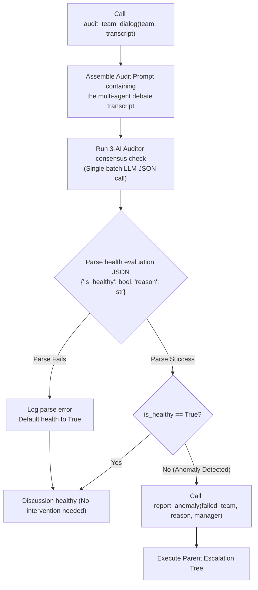
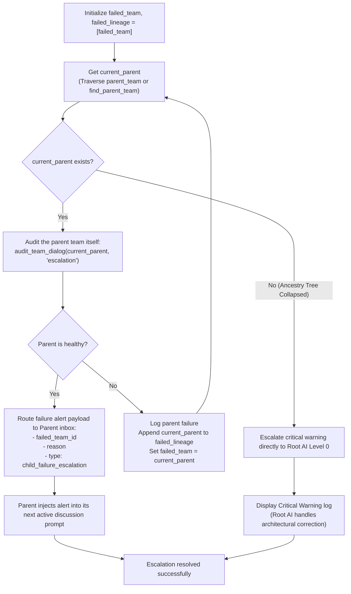

# Supervisory Team Audits & Parent Escalations Flowchart

This document details the dialogue auditing logic and the recursive lineage escalation protocol executed by the **Supervisory Team**.

## 1. 3-AI Dialogue Auditing Logic Flowchart

This flowchart outlines the sequence executed on every dynamic debate turn or discussion session to verify overall dialogue health:

## 2. Parent-Ancestor Escalation Tree Flowchart

This flowchart visualizes the recursive lineage climbing checks executed by `SupervisoryTeam.report_anomaly` to resolve failures or report alerts:

