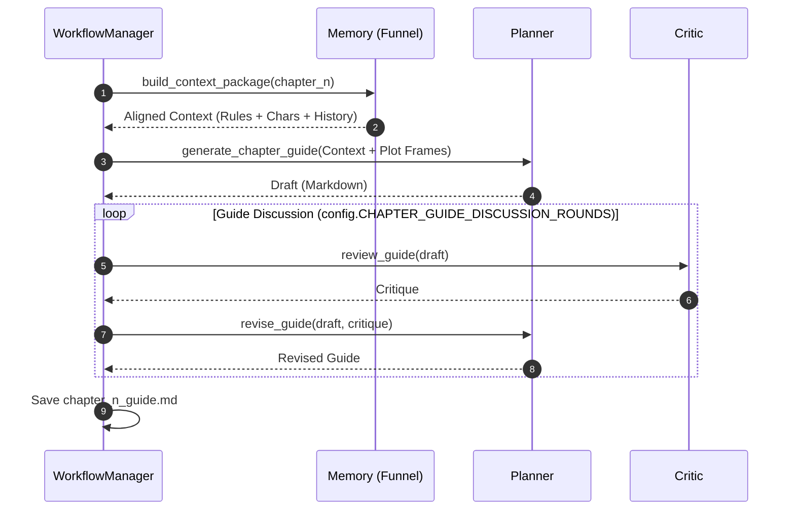
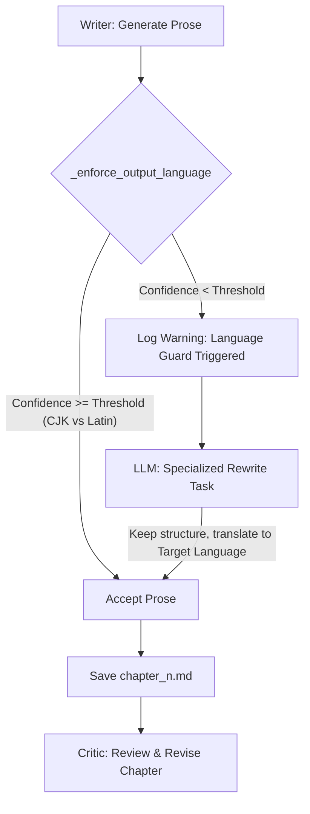
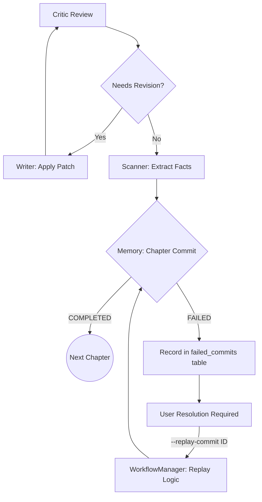

# Chapter Generation Workflow

This document details the iterative process of planning, writing, and scanning, including the automated "Guard" systems.

## 1. Chapter Planning Loop (Planner ↔ Critic ↔ Memory)

## 2. Chapter Writing & Language Guard

Every output from an LLM agent is passed through a language validator before being accepted.

## 3. Review, Scan & Commit

The final stage ensures the written text is converted back into facts and committed to memory.

