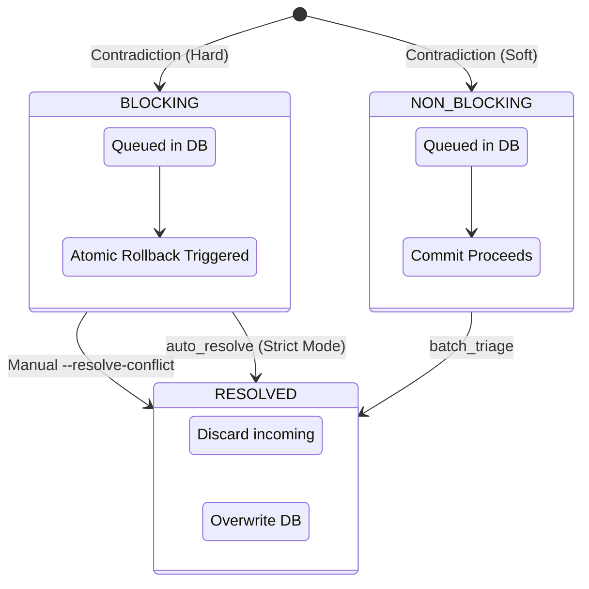

# Conflict & Integrity Management

This document details the robust mechanisms for artifact validation, interruption recovery, and conflict resolution.

## 1. Deep Interruption Recovery

When starting with `--auto`, the system performs an exhaustive integrity check rather than a simple file-exists check.

```mermaid
flowchart TD
    Start[--auto START COUNT] --> Loop[For each Chapter N in range]
    
    Loop --> ValPhys{1. Physical Validation}
    ValPhys -- "File missing OR empty" --> Discard[Mark for Regeneration]
    
    ValPhys -- "Files OK" --> ValSchema{2. Content Validation}
    ValSchema -- "Fact JSON schema invalid" --> Discard
    ValSchema -- "Discussion JSONL corrupted" --> Discard
    
    ValSchema -- "Content OK" --> ValDB{3. DB State Validation}
    ValDB -- "Commit status != COMPLETED" --> Discard
    ValDB -- "Commit payload missing" --> Discard
    
    ValDB -- "Status COMPLETED" --> Skip[Already Done: Skip Chapter N]
    
    Discard --> Clean[Purge DB incomplete commits + Delete partial files]
    Clean --> Regen[Start Generation Loop for Chapter N]
    
    Regen --> Next[Chapter N + 1]
    Skip --> Next
```

## 2. Conflict Triage State Machine

Conflicts are classified to balance automation with narrative safety.

## 3. Runtime Integrity Rules

* **Critical Globals**: `world_bible.md`, `plot_outline.md`, and `detailed_plot_outline.md` must be valid. If missing or corrupted, the system fails fast and requests `--start` again.
* **Chapter Artifacts**: If *any* artifact of a chapter (Guide, Text, Facts, Review) is missing or invalid, the entire chapter is treated as incomplete.
