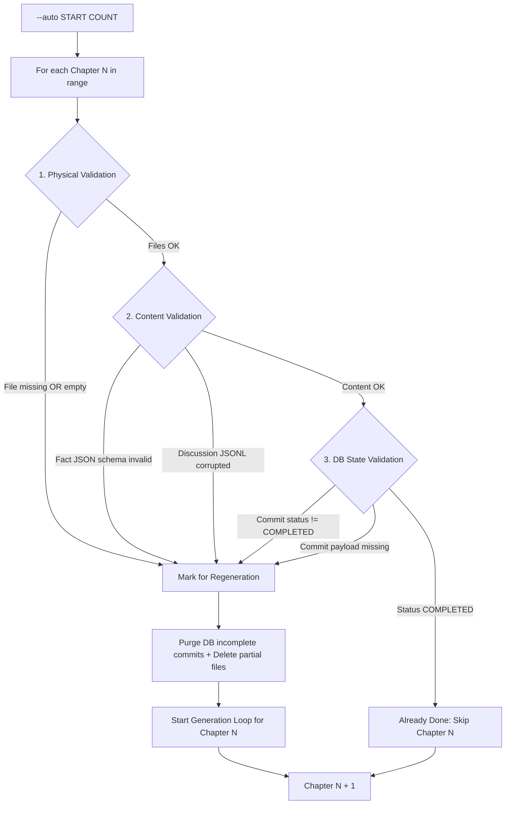
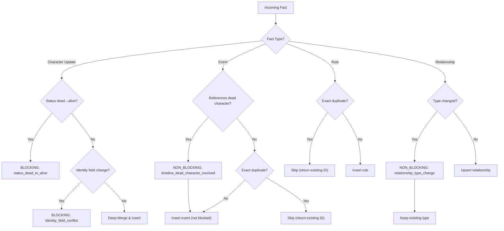
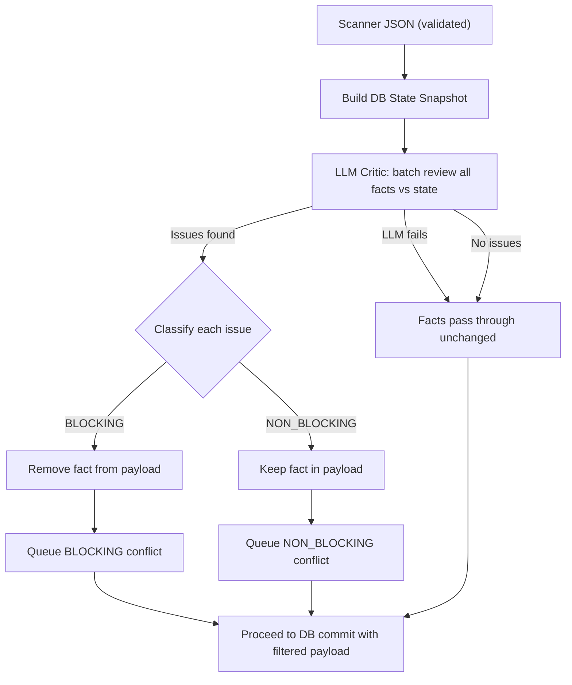
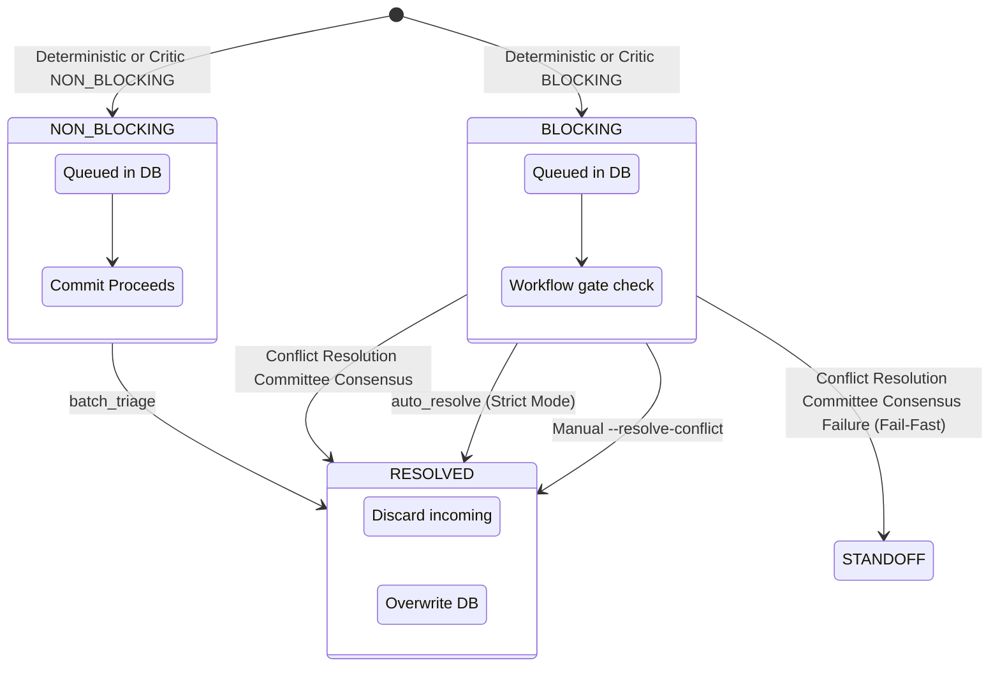
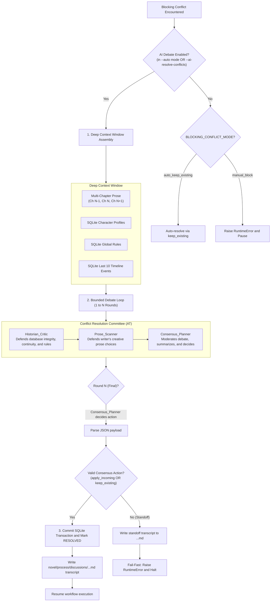

# Conflict & Integrity Management

This document details the robust mechanisms for artifact validation, interruption recovery, and conflict resolution.

## 1. Deep Interruption Recovery

When starting with `--auto`, the system performs an exhaustive integrity check rather than a simple file-exists check.

## 2. Two-Layer Conflict Detection

Conflict detection uses a two-layer architecture to balance efficiency with accuracy.

### Layer 1: Deterministic Checks (memory.py)

Performed during data insertion. Catches exact-match contradictions:

### Layer 2: LLM Critic Review (workflow.py)

Performed before DB commit in `scan_chapter()`. Catches semantic/logical contradictions:

## 3. Conflict Triage State Machine

Conflicts are classified to balance automation with narrative safety.

## 4. Conflict Resolution Committee Workflow

When continuous loops (`--auto`) or the CLI flag `--ai-resolve-conflicts` are active, the system automatically spawns a dynamic **Conflict Resolution Committee** Agent Team (AT) to resolve blocking conflicts rather than halting immediately or applying simple heuristics.

## 5. Runtime Integrity Rules

* **Critical Globals**: `world_bible.md`, `plot_outline.md`, and `detailed_plot_outline.md` must be valid. If missing or corrupted, the system fails fast and requests `--start` again.
* **Chapter Artifacts**: If *any* artifact of a chapter (Guide, Text, Facts, Review) is missing or invalid, the entire chapter is treated as incomplete.
