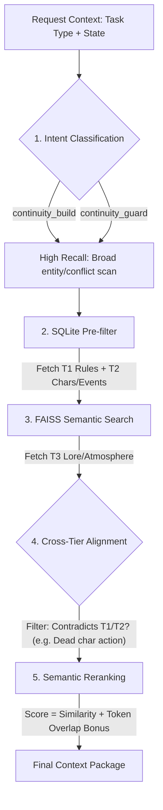
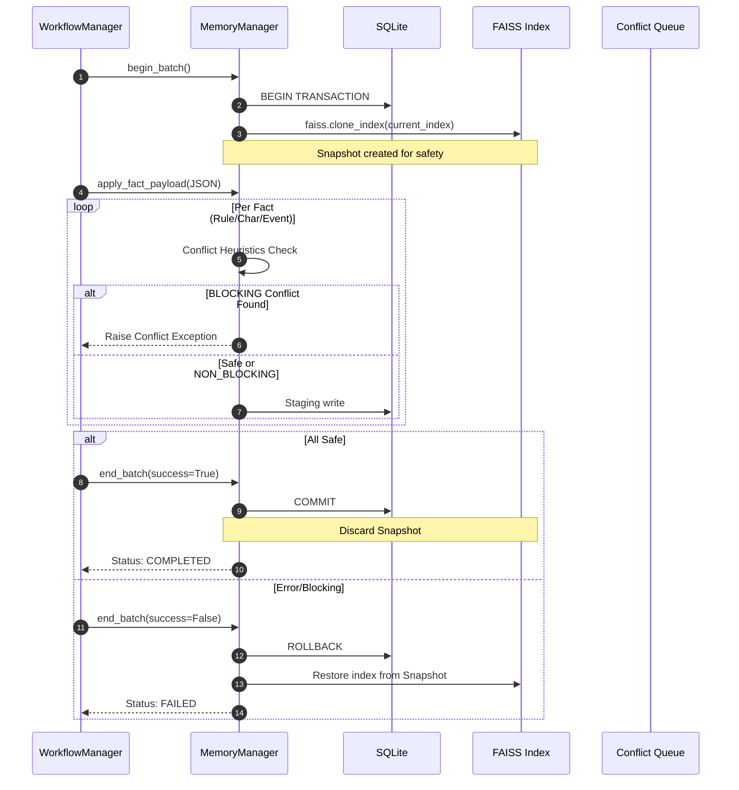

# Memory & Retrieval System

This document details the multi-tier retrieval funnel and the atomic commit/rollback mechanism used to ensure narrative consistency.

## 1. Context Retrieval Funnel (The Narrowing Funnel)

The system avoids "context pollution" by filtering and ranking facts through a 5-step pipeline.

### Reranking Heuristics

* **Entity Bonus**: +0.35 score for each focus entity token match.
* **Location Bonus**: +0.50 score for exact location match.

## 2. Atomic Chapter Commit (Scanner ↔ Memory)

Ensures that "dirty" facts from a bad scan don't corrupt the long-term memory.

## 3. Conflict Detection Heuristics

The system doesn't just match keywords; it checks for semantic contradictions:

* **Character Status Guard**: Blocks "Resurrection" (Dead -> Alive) or changing core identities.
* **Rule Contradiction**:
  * **Negation Detection**: Matches "never/no/not" against positive counterparts.
  * **Polarity Mapping**: Detects antonym pairs (e.g., "forbidden" vs "allowed").
* **Weighted Overlap**: Uses a custom weight table (e.g., "kill", "die", "death" have high weights) to detect critical timeline clashes.
