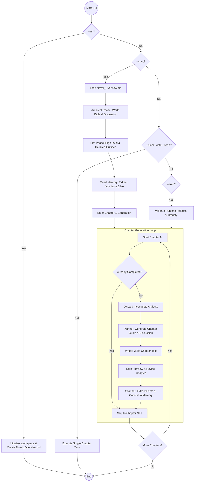

# System Orchestration Flow

This document describes the high-level control flow of the AI Novel project, from initialization to continuous generation.

## Sub-Flow Details

- [World Building & Framework](World_Building.md)
- [Chapter Generation Workflow](Chapter_Workflow.md)
- [Memory & Retrieval System](Memory_System.md)
- [Conflict & Integrity Management](Conflict_Management.md)
