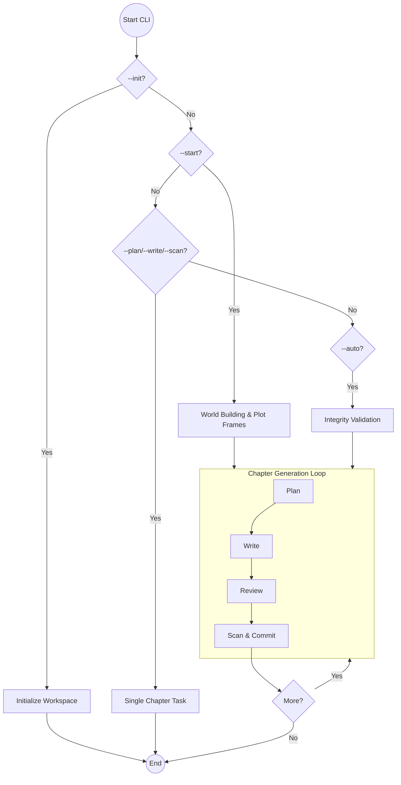

# System Flowcharts

This directory contains relatively detailed flowcharts describing the operational logic of the AI Novel project.

> [!NOTE]
> All flowcharts in this directory were largely written by Gemini and the content described at present is incomplete, \
> so it is for reference only.

## Detailed Sub-Flows

For more granular details on specific system components, please refer to the following documents:

1. **[World Building & Framework](World_Building.md)**: Details the `--start` phase, Architect agent, and Plot Outline generation.
2. **[Chapter Generation Workflow](Chapter_Workflow.md)**: Details the iterative `Plan -> Write -> Review -> Scan` loop for each chapter.
3. **[Memory & Retrieval System](Memory_System.md)**: Details how the system extracts facts, manages SQLite/FAISS tiers, and retrieves context.
4. **[Conflict & Integrity Management](Conflict_Management.md)**: Details the interruption-resume logic and the conflict triage process.
5. **[System Orchestration Overview](Orchestration.md)**: A more detailed version of the high-level flow shown above.

## High-Level Orchestration

The following diagram illustrates the overarching control flow of the system, from initialization to continuous chapter generation.

