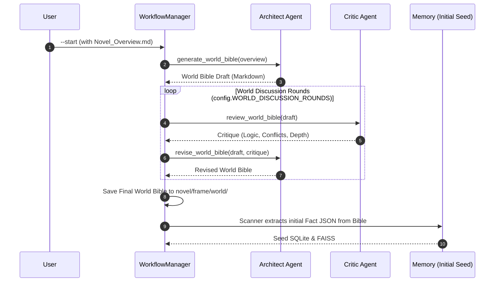
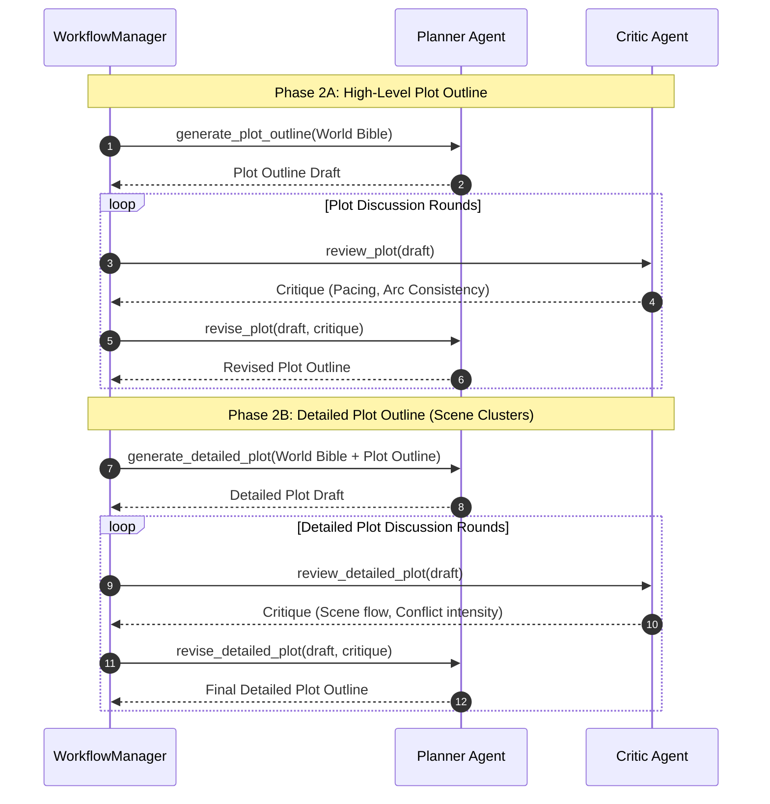

# World Building & Framework Flow

This document details the strategic planning phase where the world setting and plot frames are established.

## 1. Project Initialization Phase (Architect ↔ Critic)

## 2. Strategic Plot Planning (Planner ↔ Critic)

